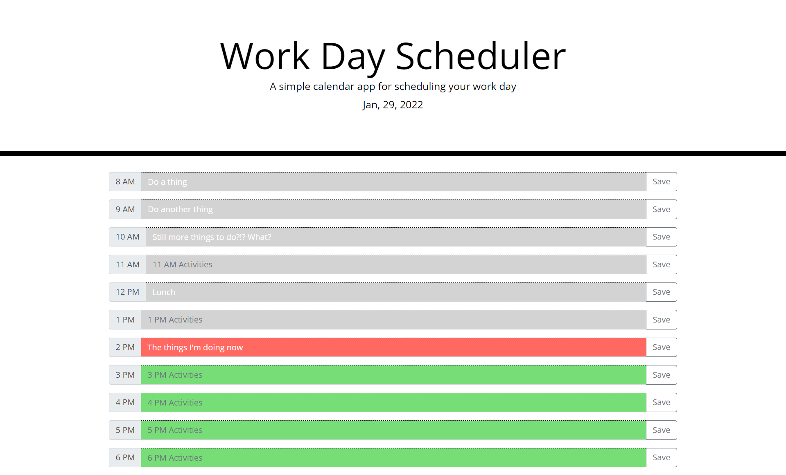

# Workday_Planner_App
Basic workday planner app using some Bootstrap and Moment.js.

## Notes
This project is an extensive refactor of provided code.  Intial code was basically the HTML header.  User story indicated a daily planner app with hour slots for each standard business hour, color coded for past present and future hours.  Users are able to input activities for their day and save them to local storage for retreival after page refresh.
Moment.JS is used currently, but project may be updated to a more modern date library.  Boostrap was utilized primarily for the input structure and some basic formatting.

## Deployed Site

[Deployed](https://danielmrva.github.io/Workday_Planner_App)

## Github

[Github](https://github.com/DanielMrva/Workday_Planner_App)
